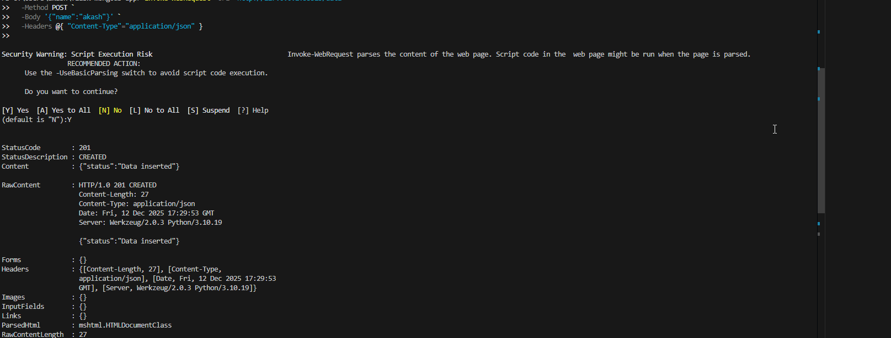
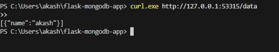

This repository contains my completed assignment for deploying a Flask application connected to MongoDB on a Kubernetes cluster. The goal was to build a working end-to-end setup including deployments, services, authentication, persistence, autoscaling, and local accessibility.

I used Minikube, Docker, and Kubernetes to complete this task.

📌 1. Project Summary

The Flask application exposes the following endpoints:

GET / → Returns a welcome message with server time

POST /data → Inserts JSON data into MongoDB

GET /data → Retrieves stored data

MongoDB runs inside the cluster with authentication enabled and persistent storage attached.
Flask is deployed with 2 replicas and connected to MongoDB using internal Kubernetes DNS.

My Flask app is accessible locally from the following URL:

http://127.0.0.1:53315/

All API examples are demonstrated using this exact URL.

📁 2. Project Structure
flask-mongodb-app/
│
├── app.py
├── requirements.txt
├── Dockerfile
├── README.md
│
└── k8s/
    ├── mongo-secret.yaml
    ├── mongo-service.yaml
    ├── mongo-statefulset.yaml
    ├── mongo-pvc.yaml
    ├── flask-deployment.yaml
    ├── flask-service.yaml
    ├── flask-hpa.yaml

This structure keeps each Kubernetes resource modular and easy to maintain.

🐳 3. Docker Image Build Process

I built the Docker image directly inside Minikube’s Docker environment:

minikube start
& minikube -p minikube docker-env | Invoke-Expression
docker build -t flask-mongodb:latest .

The Flask Deployment uses:

imagePullPolicy: Never

so Kubernetes always uses the locally available image.

☸ 4. Deploying to Kubernetes

To deploy everything:

kubectl apply -f k8s/

This creates:

MongoDB StatefulSet

MongoDB Headless Service

MongoDB Secrets

Flask Deployment (2 replicas)

Flask NodePort Service

HPA for autoscaling

Once deployed, the API becomes available at:

http://127.0.0.1:53315/

🌐 5. API Usage and Testing

(All examples use your working URL)

✔ 1. Test Root Endpoint
curl.exe http://127.0.0.1:53315/

Expected response:

Welcome to the Flask app! The current time is: <timestamp>

✔ 2. Insert Data (POST /data)

PowerShell-friendly version:

Invoke-WebRequest -Uri "http://127.0.0.1:53315/data" `
  -Method POST `
  -Body '{"name":"akash"}' `
  -Headers @{ "Content-Type"="application/json" }

Alternate (real curl):

curl.exe -X POST -H "Content-Type: application/json" ^
  -d "{\"name\":\"akash\"}" ^
  http://127.0.0.1:53315/data

Expected response:

{"status": "Data inserted"}

✔ 3. Retrieve Data (GET /data)
curl.exe http://127.0.0.1:53315/data

Expected response:

[
  {
    "name": "akash"
  }
]

🔎 6. DNS Resolution (Simple Explanation)

Inside Kubernetes, every Service gets an internal DNS entry:

<service-name>.<namespace>.svc.cluster.local

So MongoDB is resolvable as:

mongodb.default.svc.cluster.local

Since Flask is in the same namespace, using just the service name works:

MONGO_HOST = "mongodb"

Kubernetes handles all name resolution, so the Flask app always connects to the correct MongoDB pod even after restarts.

💾 7. Persistence With MongoDB

MongoDB uses a PersistentVolumeClaim (PVC), ensuring:

✔ Data is not lost when the pod restarts
✔ StatefulSet always attaches the same volume
✔ Storage consistency is maintained

I tested this by deleting the MongoDB pod:

kubectl delete pod mongodb-0

After restart, all previously inserted data remained intact.

⚙ 8. Resource Requests & Limits (Why I Used Them)

Each pod has:

requests:
  cpu: 0.2
  memory: 250Mi
limits:
  cpu: 0.5
  memory: 500Mi

These ensure:

Kubernetes schedules pods efficiently

The pods always receive a minimum amount of CPU/memory

No single pod can overload the node

Application behaves predictably under load

This helps maintain stability inside the cluster.

📈 9. Autoscaling (HPA)

Configured HPA settings:

Min Replicas: 2

Max Replicas: 5

Trigger: CPU usage > 70%

Apply:

kubectl apply -f k8s/flask-hpa.yaml

Monitor scaling:

kubectl get hpa -w

🔥 Load Testing for HPA
kubectl run load-generator --image=busybox -- sh -c \
"while true; do wget -q -O- http://flask-service:5000/data; done"

During testing, the number of Flask pods increased based on CPU usage.

✅ 10. Final Remarks

This assignment helped me demonstrate:

Containerizing a Flask application

Deploying a database with authentication

Connecting services inside Kubernetes

Using persistent storage for real-world reliability

Implementing autoscaling

Exposing services externally

Understanding Kubernetes DNS and resource limits

Everything is fully functional, and the Flask service is reachable at:

http://127.0.0.1:53315/

Below are the screenshots demonstrating the working application, API responses, and autoscaling results.

